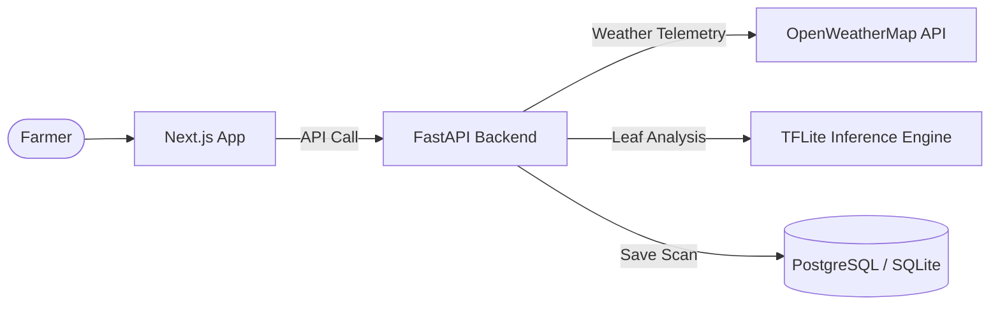

# YieldSmart 🌱 — Smart Farming Platform

[](https://www.python.org/)
[](https://nextjs.org/)
[](https://www.tensorflow.org/lite)
[](https://opensource.org/licenses/MIT)

**YieldSmart** is an advanced, production-ready smart farming companion application uniquely designed for farmers. It combines real-time weather alerts, smart soil conditions estimation, crop recommendation algorithms, and an optimized AI model to detect leaf diseases instantly and provide detailed, simple, actionable treatment and prevention plans.

---

## Key Features

- 📸 **AI Leaf Disease Detection**: Identifies plant diseases across 48 crop varieties instantly using a quantized, low-latency TensorFlow Lite model (running on Hugging Face ZeroGPU).
- 🌾 **Detailed Actionable Treatment Plans**: Provides precise treatments and organic specifications in simple, farmer-friendly language, avoiding complex scientific jargon.
- 🌦️ **Smart Dashboard**: Delivers real-time localized weather telemetry and 5-day forecasts integrated with farm safety advisories.
- 🧪 **Soil Quality Intel**: Automatically estimates Nitrogen (N), Phosphorus (P), and Potassium (K) parameters, pH levels, and soil moisture to recommend ideal crops.
- 📋 **Historical Scanning Archive**: Allows authenticated farmers to keep a clean, searchable history of their crop diagnoses.
- ☁️ **Supabase/PostgreSQL Production Integration**: Built-in SQLite database support for simple local development, with automatic fallback to Postgres for scale.

---

## System Architecture



*For more details, see the [System Architecture Guide](docs/architecture.md).*

---

## Directory Structure

This monorepo is cleanly divided into logical modules:

```
Yieldsmart/
├── docs/                              # System design & architecture documents
├── backend/                           # FastAPI server & machine learning inference
│   ├── app.py                         # Hugging Face Spaces Gradio app entrypoint
│   ├── main.py                        # FastAPI routes & endpoints
│   ├── model_service.py               # Image processing & TFLite model runner
│   ├── class_labels.json              # 48 disease remedies & remedies
│   ├── requirements.txt               # Backend dependencies
│   └── Dockerfile                     # Deploy container template
├── frontend/                          # Next.js web application
│   ├── src/                           # Pages, components, and hooks
│   └── package.json                   # UI package config
├── model/                             # ML Model resources & scripts
│   ├── notebooks/                     # Colab/Jupyter training notebook
│   └── scripts/                       # Convert & dataset helpers
├── tests/                             # Unified backend test suite
│   ├── test_api.py                    # Endpoints verification
│   └── test_model_accuracy.py         # AI accuracy stats
├── start.bat                          # One-click Windows startup script
└── LICENSE                            # MIT License
```

---

## Quick Start (Local Development)

### Prerequisites
- Python 3.10+
- Node.js 18+

### 1. Run via Bat Script (Windows)
Double-click `start.bat` in the project root. This will automatically start the backend FastAPI server, build/start the Next.js frontend developer server, and open your browser to `http://localhost:3000`.

### 2. Manual Startup

#### Backend Setup
```bash
cd backend
python -m venv venv
# Windows:
venv\Scripts\activate
# Linux/macOS:
source venv/bin/activate

pip install -r requirements.txt
# Copy environment template
cp .env.example .env
# Set your OpenWeather API key in .env
python main.py
```

#### Frontend Setup
```bash
cd frontend
npm install
# Copy environment template
cp .env.example .env.local
npm run dev
```

---

## Machine Learning Pipeline

1. **Preprocessing**: The uploaded image is verified via HSV masking to ensure it is a leaf (green threshold). It is then normalized and resized to `160x160` px.
2. **Inference**: Handled by `plant_disease_recog_model.tflite` (~67MB), achieving an average server latency of **<450ms**.
3. **Normalization**: Sigmoid scores are converted to logit levels and normalized using **Softmax** to ensure robust and calibrated confidence scores.

---

## License

This project is licensed under the MIT License - see the [LICENSE](LICENSE) file for details.
