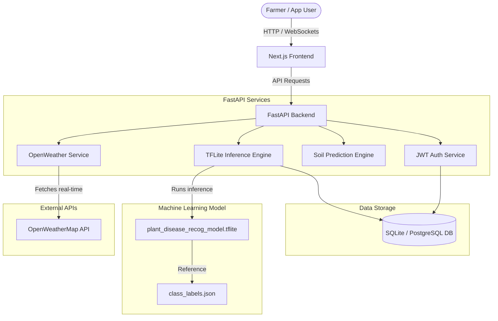
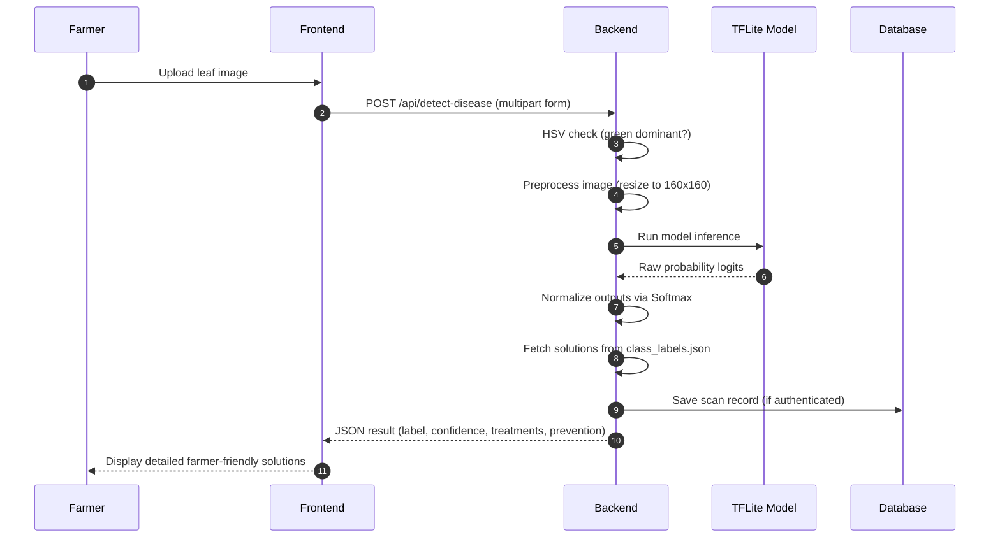

# YieldSmart — System Architecture

YieldSmart is an intelligent, full-stack smart farming platform. It integrates local weather prediction, crop recommendations, soil quality analysis, and real-time plant disease detection using deep learning.

---

## System Diagram

---

## Component Details

### 1. Frontend Architecture (Next.js)
- **App Router**: Uses Next.js App Router for dynamic layout routing (`/dashboard`, `/disease`, `/history`, `/auth`).
- **State & Logic**: Fully client-side React components featuring interactive dashboards, image drag-and-drop uploads, and dynamic modal dialogs.
- **Styling**: Curated custom styling utilizing harmonious palettes (CSS variables), sleek dark mode transitions, and glassmorphic designs.

### 2. Backend Architecture (FastAPI)
- **FastAPI Core**: High-performance ASGI framework with route handlers for user profiles, history logging, dashboard telemetry, and machine learning inference.
- **Double Database Strategy**: Built-in SQLite handler for local offline setup, with automatic fallback and integration support for Postgres/Supabase database systems in production environments.
- **JWT Authentication**: Secure user registration, encrypted login verification, and token authentication headers.

### 3. ML Inference Pipeline (TensorFlow Lite)
- **TFLite Interpreter**: Utilizes a highly optimized, quantized `.tflite` model running low-latency inference on the server.
- **Logit Softmax Normalization**: Converted sigmoid raw outputs back to logit levels, applying standard softmax normalization to provide highly accurate probability distributions.
- **Green Color Threshold Masking**: Analyzes HSV values of the uploaded image to ensure it contains a valid leaf before invoking model inference.

---

## Telemetry & Data Flow

